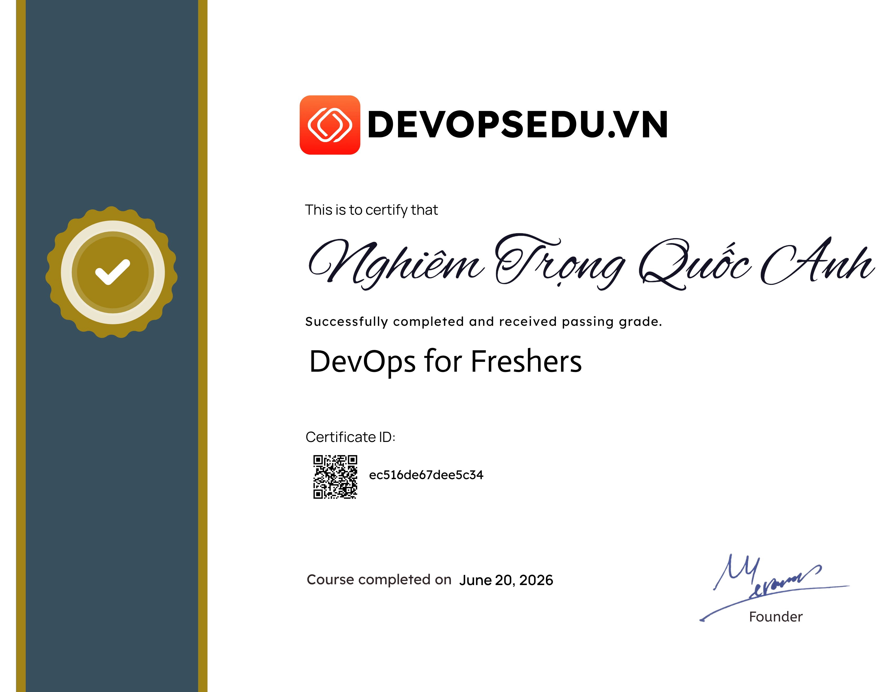

 

 

  

---

<h1 align="center">Hi , I'm Nghiem Quoc Anh</h1>

  <b>⚙️ DevOps Mindset</b> &nbsp;|&nbsp; <b>☁️ Cloud Learner</b> &nbsp;|&nbsp; <b>🔧 Backend Builder</b>

 

I am a <b>3rd-year Information Technology student at USTH</b>, aiming to become a <b>DevOps Engineer</b> or <b>Backend Engineer</b>. I enjoy building practical systems, automating deployment workflows, learning cloud infrastructure, and understanding how real production systems are monitored and operated.

- 🎯 Looking for a <b>DevOps Engineer Intern</b> or <b>Backend Engineer Intern</b> opportunity
- 🌱 Currently learning <b>AWS, GCP, CI/CD, Docker, Kubernetes, monitoring, and cloud infrastructure</b>
- 🔧 Building projects around <b>backend APIs, deployment automation, observability, and reliability</b>
- 🥅 2026 goal: land an internship and build production-ready DevOps/Backend projects
- ⚡ Favorite quote: <b>Works on my machine. Ships to production. Prays.</b>

---

## 🎯 Internship Direction

<table>
  <tr>
    <td align="center" width="50%">
      <h3>⚙️ DevOps Engineer Intern</h3>
      
<b>CI/CD · Docker · Kubernetes · Cloud · Monitoring</b>

      
I want to learn how teams build, deploy, monitor, and operate reliable systems in real production environments.

    </td>
    <td align="center" width="50%">
      <h3>🔧 Backend Engineer Intern</h3>
      
<b>Node.js · Express · REST APIs · Databases</b>

      
I want to improve my backend foundation by building clean APIs, designing databases, and creating reliable server-side services.

    </td>
  </tr>
</table>

---

## 🧰 Tech Stack

  

### Comfortable with

  
  
  
  
  

  
  
  
  

  
  
  
  
  
  

### Currently learning

  
  
  
  
  
  
  

---

## 🚀 Featured Projects

### 1. MERN CI/CD Pipeline with Monitoring

  
  
  
  
  
  

A production-like DevOps project for deploying a full-stack MERN application on Google Cloud Platform with Jenkins, Harbor, Docker Swarm, security scanning, and monitoring.

- Designed separate <b>staging</b> and <b>production</b> Jenkins pipelines using Pipeline as Code
- Containerized React frontend and Node.js backend with optimized Dockerfiles and non-root runtime direction
- Used <b>Harbor</b> as a private container registry with versioned images
- Deployed with <b>Docker Swarm</b>, rolling updates, health checks, and rollback direction
- Integrated <b>Trivy</b> vulnerability scanning before deployment
- Added observability with <b>Prometheus, Grafana, Node Exporter, and cAdvisor</b>
- Documented real troubleshooting notes and production-style deployment flow

### 2. GPA Management — AWS EKS Deployment Portfolio

  
  
  
  
  
  

A production-like AWS/EKS portfolio project for a MERN GPA/student management application. The focus is infrastructure, deployment, operations, monitoring, rollback, and cost awareness.

- Deployed frontend through <b>private S3 buckets</b>, <b>CloudFront</b>, <b>Route 53</b>, and ACM HTTPS certificates
- Ran backend workloads on <b>Amazon EKS</b> with separate <b>staging</b> and <b>production</b> namespaces
- Wrote Kubernetes manifests for Deployment, Service, ConfigMap, Secret examples, HPA, PDB, Gateway, and HTTPRoute
- Used <b>ECR</b> for backend images and Jenkins for CI/CD deployment automation
- Designed API traffic path with CloudFront → ALB → EKS Gateway API → Kubernetes Service → backend pods
- Integrated <b>CloudWatch Logs, Container Insights, dashboards</b>, and operational runbooks
- Practiced AWS security/operations concepts: IAM, Pod Identity, WAF, private buckets, rollback, and cost inventory

### Other Projects

| Project | Focus | Highlights |
|---|---|---|
| [project-machine-learning](https://github.com/QuocAnhNghiem/project-machine-learning) | Machine Learning | EPL match prediction with Logistic Regression, Min-Max scaling, Gradient Descent, threshold sweep, hyperparameter tuning, Docker Compose, report and slides |
| [cicd-nodejs-k8s](https://github.com/QuocAnhNghiem/cicd-nodejs-k8s) | CI/CD + Kubernetes Practice | Node.js app with Dockerfile, Jenkinsfile, Kubernetes manifests for backend, MongoDB, ConfigMap, Secret, Service, Deployment, and automated test setup |
| [stqa-manual-testing-stqa_group_15](https://github.com/QuocAnhNghiem/stqa-manual-testing-stqa_group_15) | Manual Testing / STQA | Library system testing project with SRS/BRD analysis, test cases, test execution, bug reports, screenshots, and summary documentation |

---

## 🏆 Certificates & Achievements

<table>
  <tr>
    <td align="center" width="50%">
      <h3>🎓 3 Years Scholarship</h3>
      
Received university scholarship for <b>3 consecutive years</b> through consistent academic performance.

    </td>
    <td align="center" width="50%">
      <h3>📜 DEVOPSEDU Certificate</h3>
      
Completed DEVOPSEDU certificate and continuing to improve DevOps, cloud, and backend skills.

    </td>
  </tr>
</table>

  

<i>Click the certificate image to view it in full size.</i>

---

## 📊 GitHub Stats

  
  
  

  
  
  

  

---

## 🧭 Currently Learning & Building

| Area | Focus |
|------|-------|
| ☁️ Cloud | AWS, GCP, cloud fundamentals, deployment architecture |
| ⚙️ DevOps | CI/CD, Jenkins, Docker, Kubernetes, Docker Swarm |
| 🔧 Backend | Node.js, Express, REST API, database design |
| 📊 Monitoring | Grafana, Prometheus, EFK, logs, metrics, alerts |
| 🧩 Problem Solving | C for LeetCode and algorithm practice |

---

## 😄 More About Me

- 🏸 I like playing badminton and pickleball
- 🎮 I enjoy gaming and watching movies
- 😂 I like keeping a funny vibe while still learning seriously
- 🧠 I believe consistency beats motivation
- 🚀 I want to become the kind of engineer who can build, deploy, monitor, and improve systems end-to-end

---

## 📬 Contact & Links

  

&nbsp;&nbsp;

&nbsp;&nbsp;

---

## 📝 Information to Add Later

- [x] LinkedIn profile URL
- [ ] CV link
- [ ] Portfolio website link
- [ ] Certificate images in `images/certificates/`
- [ ] More featured projects, ideally 2–3 projects with demo screenshots or architecture diagrams
- [ ] GitHub Actions workflow for contribution snake if you want that section

---

  

## 

